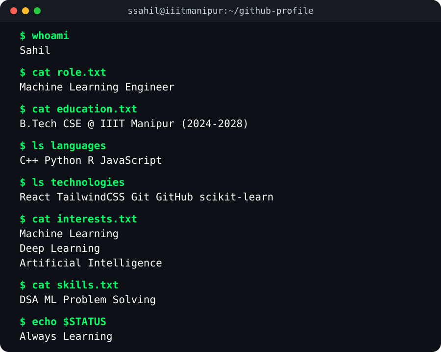

<div align="center">


<div style="margin-top:-95px;">
  
</div>

</div>

<div align="center">
  <a href="https://git.io/typing-svg">
    
  </a>
</div>

<br/>

<div align="center">
  <a href="https://www.linkedin.com/in/sahil-b870593a4" target="_blank">
    
  </a>
  &nbsp;&nbsp;&nbsp;
  <a href="https://leetcode.com/u/Sahil-2526/" target="_blank">
    
  </a>
  &nbsp;&nbsp;&nbsp;
  <a href="https://mail.google.com/mail/?view=cm&fs=1&to=sahil.26.02.2007@gmail.com&su=Hello%20Sahil!&body=I%20saw%20your%20Github%20profile..." target="_blank">
    
  </a>
</div>

<br/>

<div align="center">
  
</div>

<br/>

```text
    
╭─────────────────────────────────────────────────────────────╮
│                                                             │⠀⠀  ⠀⠀⠀⠀⠀⠀⠀⠀⠀⠀⣴⡀
│  OS         : Windows 11                                    │⠀⠀⠀⠀  ⠀⠀⠀⠀⠀⠀⠀⢰⣿⣷⡀⠀
│  Host       : IIIT Manipur                                  │⠀  ⠀⠀⠀⠀⠀⠀⠀⠀⠀⠀⣾⣿⣿⣷⣀⣀⣀⣀⠀⠀⠀⠀⣀⣀⣀⣀⣠⣤⡤ 
│  Kernel     : B.Tech CSE (2024 - 2028)                      │⠀⠀⠀  ⠀⠀⠀⠀⠀⢀⣀⢰⣿⣿⣿⣿⣿⣿⣿⣿⣿⣿⣿⣿⣿⣿⣿⣿⡿⠋
│  Uptime     : 20 years                                      │⠀⠀⠀⠀⠀  ⠀⠀⠀⠈⣿⣿⣿⣿⣿⣿⣿⣿⣿⣿⣿⣿⣿⣿⣿⣿⠿⠋⠀
│  Hobbies    : Basketball, Sketching                         │⠀⠀⠀⠀⠀⠀  ⠀⠀⢰⡇⣿⣿⣿⣿⣿⣿⡿⠟⣻⣿⣿⣿⣿⣿⣥⣄⣀⣀⣀⡀   
│  Contact    : sahil.26.02.2007@gmail.com                    │⠀  ⢀⣴⣶⣶⣦⣤⣄⠀⢷⣼⣿⣿⡿⠻⠁⠀⠀⣿⣿⣿⣿⣿⣿⣿⣿⠿⠛⠁⠀
│                                                             │  ⢀⣿⡿⢻⣿⣿⠿⠟⠀⠀⠟⠛⢿⠿⠿⠷⡶⠚⢻⣿⣿⣿⣿⣿⣋⣁⠀
╰─────────────────────────────────────────────────────────────╯  ⠹⡟⠀⠸⡿⠁⠀⠀⠀⠀⠈⢄⠈⠀⠀⠀⠁⢀⣾⣿⣿⣿⣿⠿⠋⠁⠀
                                                              ⠀⠀⠀  ⠀⠀⠀⠀⠀⠀⠀⠀  ⠀⠑⠶⣤⣤⣶⣟⣿⣻⣿⣿⣿⡀⠀⠀
⠀⠀⠀⠀⠀⠀⠀⠀⠀⠀⠀⠀⠀                                                               ⢀⣴⣿⣿⣿⣿⣿⡾⣿⣿⡣⠀⠀⠀⠀                       ⠀⠀
⠀⠀⠀⠀⠀⠀⠀⠀⠀⠀                                                              ⠀⠀⠀⣿⠟⢻⣿⣿⢿⣿⣿⡝⠻⢷⣄⠀⠀⠀⠀                       ⠀
⠀⠀⠀⠀⠀⠀⠀⠀⠀⠀⠀⠀                                                              ⠀⠃⠀⢸⡿⠁⠀⣿⡟⠀⠀⠀⠀⠀⠀⠀⠀⠀                        
⠀⠀⠀⠀⠀⠀⠀⠀⠀⠀⠀⠀⠀                                                               ⠀⠀⠘⠁⠀⠀⡟⠀⠀⠀⠀⠀⠀⠀⠀⠀
⠀                         ⠀
```
<br/>

<div align="center">
  
</div>

<br/>

<h1 align="center"> ABOUT ME</h1>
<p align="center">
  
</p>
<br/>

<div align="center">
  
</div>

<br/>

<h1 align="center"> TECHNICAL ARSENAL</h1>

<div align="center">

|  CORE LOGIC (BACKEND & DSA) | CREATIVE VISUALS (FRONTEND) |
|:---:|:---:|
| <br/>  <br/><br/> | <br/>  <br/><br/> |
| C / C++ / PYTHON | REACT / GSAP / TAILWIND |

</div>

<br/>

<div align="center">
  
</div>

<br/>

<h1 align="center"> CODING ACTIVITY</h1>
<div align="center">
  
</div>

<br/>
<h1 align="center">📊 GITHUB STATS</h1>

<p align="center">
  
</p>

<div align="center">
  
</div>
